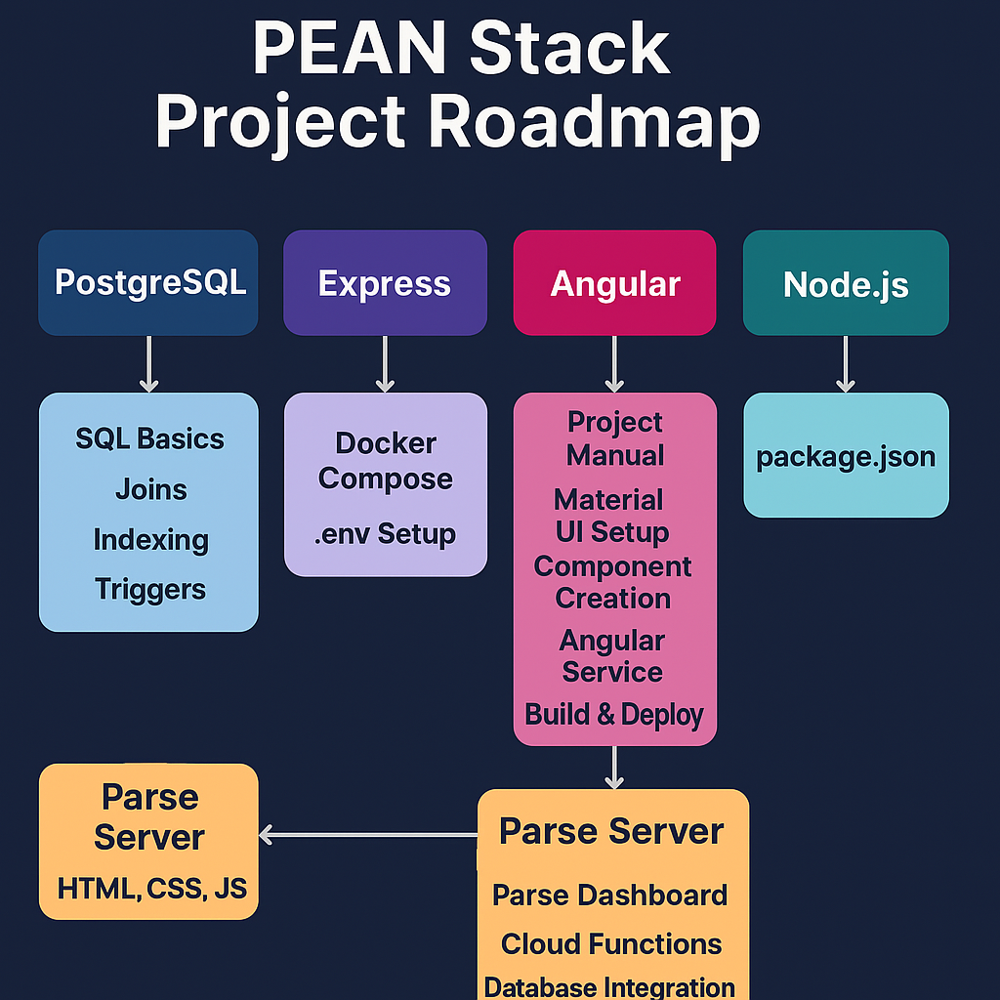

# 🚀 PEAN Stack Project Roadmap

Welcome to the **PEAN Stack Project Roadmap** — a complete, structured guide to mastering the PEAN stack (PostgreSQL, Express, Angular, Node.js) through real project-based learning.

---

## 📚 What’s Inside?

This repository is a collection of developer-written manuals, tutorials, and project guides that will take you from **zero to full-stack deployment**.

Each section corresponds to a technology in the PEAN stack and includes **step-by-step manuals** created for self-learners and junior developers.

---

## 🧱 Folder Breakdown

### 📌 Angular (`A_Angular/`)
- Angular Introduction
- Frontend Project Manual (Sign-in, Sign-up, CRUD)
- Angular Material UI Setup
- Creating Angular Components
- Angular Service & Core Concepts
- Building and Deploying Angular Projects

### 📌 Express (`E_Express/`)
- Docker Compose Setup
- `.env` Setup for Configuration

### 📌 PostgreSQL (`P_PostgreSQL/`)
- [Coming Soon] SQL Basics, Joins, Indexing, Triggers, Advanced Queries

### 📌 Node.js (`N_Node/`)
- Project `package.json` Reference
- Node.js Environment Setup

### 📌 Parse Server (`Parse_Server/`)
- Setup Parse Dashboard + PostgreSQL
- Cloud Functions
- Authentication and Database Integration

### 📌 Frontend Basics (`Frontend_Basics/`)
- HTML, CSS, JS Fundamentals

---

## 🌐 How to Use This Repo

1. **Clone the Repository**
   ```bash
   git clone https://github.com/WaqasAly/PEAN-Stack-Roadmap.git
   ```

2. **Browse the folders** by stack — pick Angular, Node, Express, etc.
3. **Read the guides**, follow the steps, and start building!
4. Combine backend + frontend using the Parse Server with PostgreSQL setup.

---

## 📷 Roadmap Diagram

> *(Add this once you upload a visual roadmap to `/assets`)*



---

## 🤝 Contribute

Want to add improvements, more projects, or advanced topics?
- Fork the repo
- Add your changes
- Make a PR ❤️

---

## 📄 License

This project is open-source and available under the [MIT License](LICENSE).

---

### ✨ Made with effort and coffee by [Waqas Rashid](https://github.com/WaqasAly)
